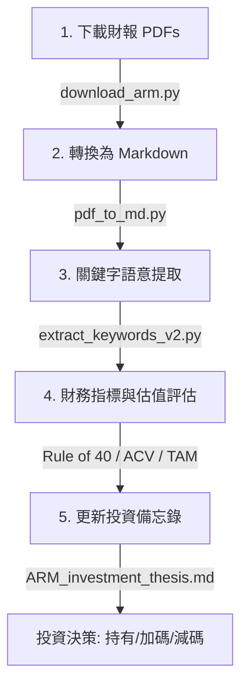

# ARM 財報分析與投資研究工作流程 (ARM Analysis & Investment Research Workflow)

此工作流程文件記錄了我們針對 ARM Holdings 的定期財報追蹤、數據分析及投資價值評估的自動化研究流程。

---

## 🛠️ 工作流程總覽 (Workflow Overview)

這個工作流程分為 5 個核心步驟：從**資料下載、格式轉換、關鍵字語意提取、高估值指標檢視**到**投資備忘錄更新**。



---

## 📋 詳細步驟與執行工具 (Detailed Steps)

### 階段 1：財報資料下載 (Data Collection)
*   **目標**：從 ARM 投資人關係官網自動抓取每一季的致股東信 (Letter)、法說會簡報 (Presentation) 與電話會議逐字稿 (Transcript)。
*   **命名規則**：`YY`Q`X`_`FileType`.pdf (例如：`26Q3_Letter.pdf`)。
*   **自動化工具**：[download_arm.py](file:///f:/AI/download_arm.py)
*   **執行指令**：
    ```bash
    python download_arm.py
    ```
*   **存放路徑**：`fin_analysis/ARM/YYQX/` (例如：[26Q3](file:///f:/AI/fin_analysis/ARM/26Q3))。

### 階段 2：格式轉換 (Data Processing)
*   **目標**：將下載的 PDF 文件轉換為包含表格結構的高品質 Markdown 格式，以便後續 LLM 分析與文字比對。
*   **自動化工具**：[pdf_to_md.py](file:///f:/AI/pdf_to_md.py) (基於 `pymupdf4llm` 函式庫)。
*   **執行指令**：
    ```bash
    python pdf_to_md.py
    ```

### 階段 3：語意概念與關鍵字提取 (Information Extraction)
*   **目標**：掃描電話會議逐字稿與財報，透過「語意概念集」比對技術趨勢與隱藏風險，避免單一字詞比對的盲區。
*   **關鍵主題**：
    - **Compute Subsystems (CSS)**：追蹤客戶導入速度與營收轉換。
    - **RISC-V 競爭**：監控是否有開源架構分食市佔率。
    - **自研晶片 (Custom Silicon)**：觀察雲端大廠 (CSP) 轉向 ARM 架構的進展。
*   **自動化工具**：[extract_keywords_v2.py](file:///f:/AI/fin_analysis/extract_keywords_v2.py)
*   **執行指令**：
    ```bash
    python extract_keywords_v2.py
    ```

### 階段 4：財務與高估值指標檢視 (Valuation Metrics)
*   **目標**：除了營收與毛利率外，專注於 SaaS 型/輕資產高估值公司的三大核心指標：
    1.  **Rule of 40 (40 法則)**：年營收成長率 + Non-GAAP 營業利益率 需保持在 50% 以上。
    2.  **ACV (年化合約價值) 成長率**：衡量新產品 (CSS) 授權動能。
    3.  **Data Center 與 Auto 的 TAM 市佔率**：追蹤 ARM 架構在雲端與車用 SDV 的滲透率。

### 階段 5：更新投資備忘錄 (Thesis Update)
*   **目標**：將最新季度的質化見解與量化數據寫入 [ARM_investment_thesis.md](file:///f:/AI/fin_analysis/ARM_investment_thesis.md)。
*   **輸出成果**：滾動式維護持倉邏輯，用 10 小時/週的分析，驗證持股在 3 至 5 年內是否具備翻倍潛力。

---

## 📈 未來擴充計劃 (Next Steps)
*   **Action Item 1**：開發一個 Python 腳本將過往所有季度的財報數據（Rule of 40、ACV 成長率、TAM 佔比）統一萃取成一份 CSV 文件。
*   **Action Item 2**：持續追蹤新季度 (例如 26Q4) 的資料發佈並重複此工作流程。
